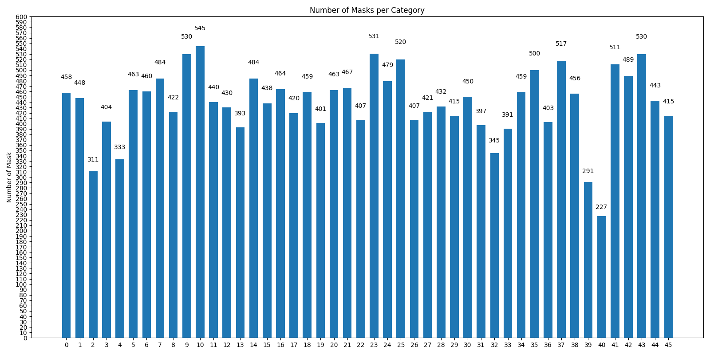

# Semantic Segmentation on Describable Textures Dataset
*This repository was created as a homework assignment during my Msc. studies in Data Science.*

The data set consists of images with different structures which have to be classified. However, 
instead of a simple label a mask must be predicted (semantic segmentation).
For the first network, only conv layers may be used. For the second network the choice is 
of the network architecture is free. I decided to use a U-Net, which was developed by the 
University of Freiburg, Germany.

### Setup
Create the conda environment and activate it:
```shell script
conda env create -f environment.yml
conda activate describable-textures-dataset
```

Download the images:
```shell script
python dtd_loader_color_patches.py
```

Arguments:
- `--tiled`: Set to `True` if you want to use tiled images

Also both dataset (tiled and not tiled) can be downloaded. However, in the file `config.yaml` must be specified which
dataset shall be used for training and testing.

### Mask Distribution
The following plot shows the distribution of the mask:



This distribution is only considered if the BCE with logits loss is used.


### General Settings
Some general configurations are specified in the file `config.yaml`:
- `device`: either `cuda` or `cpu`
- `num_classes`: Number of classes, must be 47 for the dtd dataset
- `max_num_epoch`: Max. number of epochs (or number of epochs without early stopping)
- `loss`: The loss function, must be one of `cross-entropy`, `dice` or `bce-with-logits`
- `tiled`: `True` if the tiled dataset shall be used

### Train a model
```shell script
python train.py [OPTIONS]
```

Arguments:
- `--learning_rate`: The learning rate
- `--batch_size`: The batch size
- `--model_name`: Name of the model, one of `'simple_fcn'`, `'simple_u-net'` or `'pretrained_u-net'`
- `--wandb`: Set to `True` if you want to use [wandb.ai](wandb.ai), default is using Tensorboard
- `--early_stopping`: Set to `True` if you want to use early stopping

##### Run Sweep
With wandb, it is also possible to run sweeps. First, define the `model_name` in the
File `sweep.yaml` and then execute:

```
wandb sweep sweep.yaml
wandb agent your-sweep-id
```

### Run a pretrained model
```shell script
python evaluate.py [OPTIONS]
```
Arguments:
- `--model_name`: Name of the model, one of `'simple_fcn'`, `'simple_u-net'` or `'pretrained_u-net'`
- `--accuracy` Set to `True` if the Top-1 accuracy on the test set shall be calculated
- `--plot` Set to `True` if some predictions shall be plotted

### Results
TODO